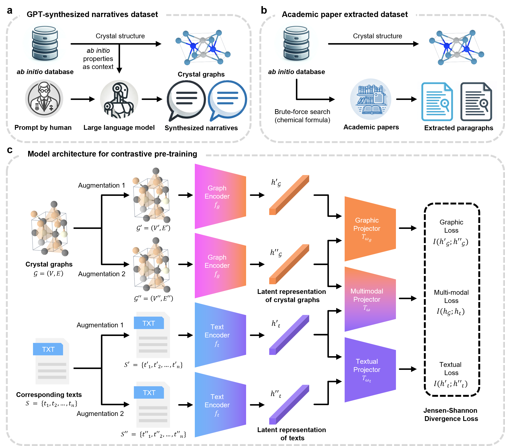

# Contrastive Language-Crystal Pretraining

This is the official implementation of Contrastive Language-Crystal Pretraining (CLaC). In this work, we introduced a contrastive pretraining framework for multimodal representation learning between materials science knowledge and crystals (~126k materials-narratives pair dataset). CLaC enables multimodal tasks which was unattainable before even with latest large language models(LLMs) while improves downstream performances. Just as we interpret images and express them in words, CLaC could be a part of AI which can be utilized as a fundamental model to analyze crystal structures and identify suitable application fields, or conversely, to search for crystal structures with characteristics that align with specific applications.



## Installation
Below is the recommended conda environment setup to reproduce this work.
```bash
conda create -n clac python=3.10.13
conda activate clac

pip install -r requirements.txt

python -m spacy download en_core_web_sm
```

## Dataset
### Data configuration
We have proposed the following three data configurations for training CLaC:

1. **Academic paper dataset**: Text extracted from real research papers using materials as queries.
2. **Synthesized Text**: Text generated by leveraging the inference capabilities of LLMs based on material property values extracted from open materials databases.
3. **Mixed Dataset**: A dataset combining data from (1) and (2).

We appreciate your understanding that we are unable to fully share all data and the corresponding pretrained model weights due to potential copyright concerns regarding academic literature. However, the synthesized data is publicly available at [GPT-Narratives-for-Materials](https://huggingface.co/datasets/yjeong/GPT-Narratives-for-Materials).

### Preprocessing 
This is instruction for acquiring crystals-language data acquisition.

1. Run `python data/generate_cif.py ` to generate and save cif texts of corresponding crystals.

2. Using `gen_graph.py`, we can generate graphs for each crystals. Output is automatically splitted into train/valid/test and saved in `.parquet` format.   
    - For example, `example_train.parquet`, `example_val.parquet` and `example_test.parquet`.

## Pre-training

This is the instruction to train a multimodal model on dataset.
Put the all splitted data in same directory and just input the name of dataset like `example`.

### Set configuration of training
See `yaml` files in `config` section. If you want to change training configuration, modify them before running.

### Run pretraining
Training code is based on pytorch lightning and hydra configuration.    
To pretrain the CLaC model, run `python train.py` with appropriate configuration.

## Evaluation for zero-shot tasks
In this work, we measured zero-shot ability of our CLaC.  
For zero-shot retrieval, we measured the model's performance in finding corresponding crystals when given texts, and vice versa.   
For zero-shot multimodal understanding, we utilized multiple-choice questions (included in [GPT-Narratives-for-Materials](https://huggingface.co/datasets/yjeong/GPT-Narratives-for-Materials)) regarding crystals, such as their composition and structure.   
Both experiment can be conducted by running `python compute_metrics.py` with appropriate arguments.

## Fine-tuning for downstream tasks
In this work, we tested generalization ability of our model for downstream tasks such as named entity recognition and paper abstract classification.   
We used same code in [MatSciBERT](https://github.com/M3RG-IITD/MatSciBERT) for those fine-tuning. Please follow instructions in the MatSciBERT repository, with the only modification being the model.   
These code will directly return the performance of the model.


# Acknowledgement
- Pytorch implementation of [PaiNN](https://github.com/MaxH1996/PaiNN-in-PyG/blob/main/)
- Self-supervised learning strategies from [CLIP-Lite](https://github.com/4m4n5/CLIP-Lite)
- Fine-tuning codes for downstream tasks from [MatSciBERT](https://github.com/M3RG-IITD/MatSciBERT)
